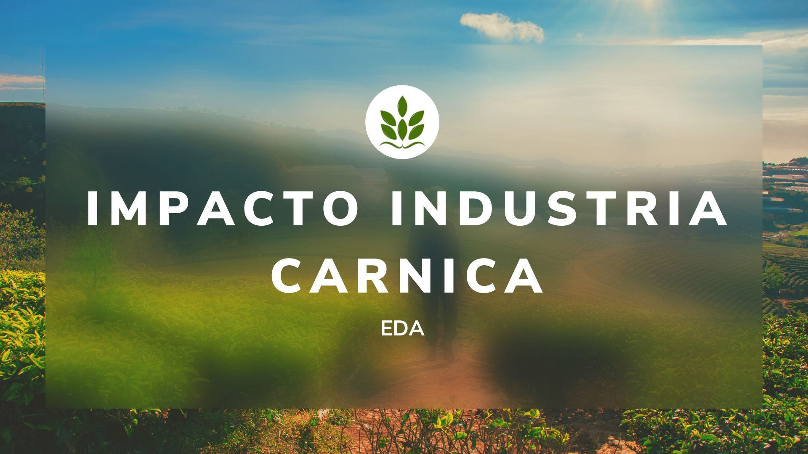

# EDA - Impacto  industria cárnica - Mayo 2023

## Introducción 📋

_Este estudio analiza la relación entre la población bovina, las emisiones de la industria cárnica y la agricultura. Mediante técnicas estadísticas y visualización de datos, se busca comprender el impacto ambiental de estas actividades y contrastar las emisiones generadas por la industria cárnica con las asociadas a la agricultura. El objetivo es destacar la importancia de considerar alternativas sostenibles en la producción y consumo de alimentos_

----------
 ## Estructura repositorio. 📖 

 _Data: Esta carpeta contiene todos los conjuntos de datos utilizados en el estudio. Estos archivos son empleados en los notebooks para realizar el análisis y generar los gráficos.

_Notebooks: Aquí se encuentran los notebooks utilizados para el tratamiento de los datos y la creación de los gráficos. Estos notebooks contienen el código y las explicaciones paso a paso de los procesos realizados.

_Gráficos: En esta carpeta se almacenan los gráficos generados a partir de los datos analizados. Los archivos se encuentran en formato PNG y representan visualmente los resultados obtenidos.

## Fuentes 📚 
_Para ese EDA hemos recogido datos de la web europea eurostat y ourworldindata._

***Repository link:*** https://github.com/JuditRoca/EDA.git

*Para clonar este repositorio por https:*

"git clone https://github.com/JuditRoca/EDA.git"
